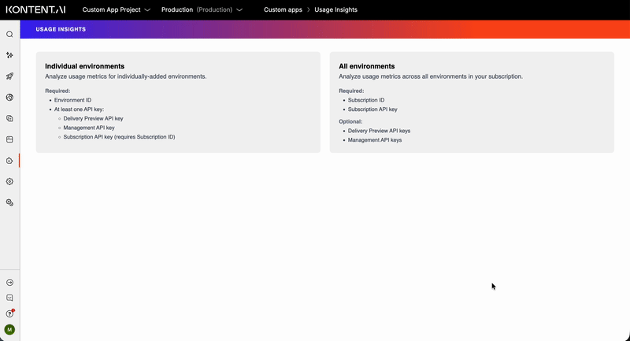
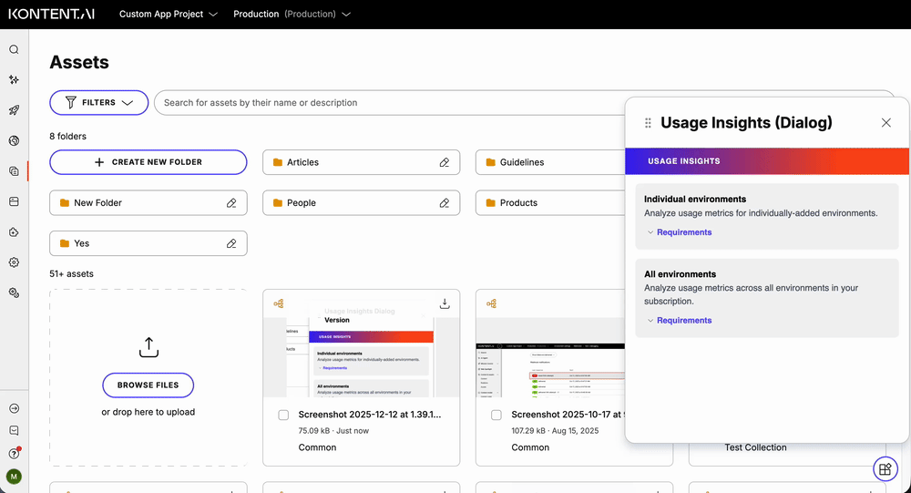

# Kontent.ai Usage Insights Tool

This is a comprehensive tool designed for [Kontent.ai](https://kontent.ai/) users who want to analyze their usage metrics across environments and gain insights into their content management patterns. The tool provides detailed usage analytics similar to the official Kontent.ai [usage report](https://kontent.ai/learn/docs/subscriptions-payments/usage-report), but with environment-level granularity. You can try it out [here](https://usage-insights.netlify.app/).

## Demo

### Full Screen Mode

### Dialog Mode

## What does it do?

- **Analyzes usage metrics** across single or multiple Kontent.ai environments
- **Collects comprehensive data** including active languages, active users, asset count, asset storage, collections, content items (all languages), content types, custom roles, and spaces
- **Supports multiple API access levels**- works with Delivery API, Management API, and Subscription API keys to retrieve different metrics
- **Provides environment-level insights** that complement the subscription-wide Kontent.ai usage report
- **Exports detailed reports** in Excel, CSV, and JSON formats for further analysis
- **Progressive data collection**- shows what data is available based on your API key permissions

## Who is it for?

- **Subscription administrators and project managers** who need detailed insights into their usage across environments. Subscription administrators can analyze all environments in their subscription, while project managers can analyze individual environments.

## How does it help?

- **Provides granular insights:** See usage metrics at the environment level, not just subscription-wide
- **Identifies optimization opportunities:** Understand which environments consume the most resources
- **Supports capacity planning:** Track growth patterns and plan for future needs

## How to use it

### Individual Environments Mode

1. **Select "Individual environments" mode**
2. **Enter your Environment ID and available API keys** (Delivery Preview, Management, and/or Subscription)
3. **Add additional environments** as needed
4. **Click "Collect Usage Data"** to analyze the environments
5. **Review the metrics** including content items (all languages), content types, asset count, and more
6. **Export the report** in Excel, CSV, or JSON format

### All Environments Mode

1. **Select "All environments" mode**
2. **Enter your Subscription ID and Subscription API Key**
3. **Click "Load Projects & Environments"** to automatically load all environments in your subscription
4. **Add API keys** (Delivery Preview and/or Management) for each environment as needed
5. **Click "Collect Usage Data"** to analyze all environments
6. **Review comprehensive metrics** across all environments, organized by project
7. **Export the report** in Excel, CSV, or JSON format

### Kontent.ai Custom App

This tool can be deployed as a [Kontent.ai custom app](https://kontent.ai/learn/docs/custom-apps) for seamless integration into your Kontent.ai environment.

**Setup:**
1. Deploy this application to a web server (e.g., Netlify, Vercel, or your own hosting), or use my deployment to automatically receive updates: https://usage-insights.netlify.app/.
2. In Kontent.ai, navigate to **Environment settings** > **Custom apps**.
3. Click **Create new custom app**.
4. Enter a name for your app and the hosted URL.
5. Select which roles can access the app.
6. Select the "Full screen" or "Dialog" mode, depending on how you'd like to use it.
7. Click **Save changes**.

**Usage:**
- The app will automatically detect your environment ID from the Kontent.ai context when using "Individual environments" mode.
- All functionality remains the same as when using the tool outside of Kontent.ai.

**Benefits of Custom App Mode:**
- **Seamless integration** into your Kontent.ai workflow
- **Automatic environment detection**- no need to enter your Environment ID in Individual environments mode
- **Role-based access control**- restrict access to specific user roles
- **No external tool switching**- everything stays within Kontent.ai

---

**Note:** No data is stored— everything runs in your browser. API keys are handled in memory only and never persisted.

## Deploying

Netlify has made it easy to deploy and host this application. If you click the deploy button below, it will guide you through the process of deploying it to Netlify and leave you with a copy of the repository in your GitHub account as well.

